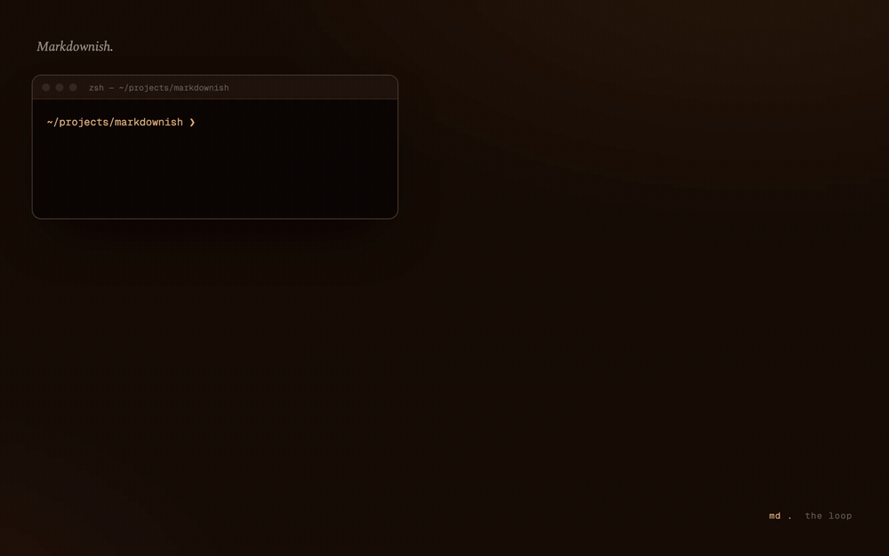

# Markdownish

A personal, no-fluff markdown editor and viewer. Open a folder, see the markdown files,
edit them with a split live preview. That's it.

Built because opening a full IDE just to tweak `CLAUDE.md` or `AGENTS.md` is overkill.

<p align="center">
  
</p>

<p align="center">
  <em>Walnut &amp; copper foil. Spectral &amp; Geist.<br>
  For the wretched business of editing markdown at strange hours.</em>
</p>

## Features

- **Folder-rooted** — pick a folder; the sidebar shows every `.md` / `.mdx` / `.markdown`
  inside, recursively. `node_modules`, `target`, dotfiles, and other noise stay hidden.
- **Pinned files at the top** — `CLAUDE.md`, `AGENTS.md`, `SKILL.md`, `README.md`,
  `PRODUCT.md`, `DESIGN.md` get auto-pinned when present at the root.
- **Split live preview** — Spectral display, Geist body, drop cap on the first paragraph
  after `# H1`, copper foil accents on links, tables, and `<hr>`s.
  Toggle editor-only / split / preview with **⌘ \\**.
- **Plain-textarea editor** — Geist Mono, copper caret, marginalia footer with word
  count and line position. `⌘ S` saves. Auto-save 2s after the last keystroke as a
  safety net.
- **Frontmatter card** — YAML frontmatter is parsed and rendered as a colophon above
  the preview body. The raw frontmatter stays in the source.
- **Quick open** — `⌘ P` opens a spotlight-style file picker for the whole folder.
- **Math** — `$inline$` and `$$block$$` LaTeX render with KaTeX in the preview.
- **Outline** — `⌘ ⇧ O` toggles a docked table of contents built from the headings;
  click an entry to jump (scrolls the preview, or the editor when preview is hidden).
- **Document stats** — a status strip under the editor shows live word count,
  reading time, and paragraph count.
- **Export** — send the current document to **PDF** (via the print panel), a
  standalone **HTML** file, a **PNG** of the preview, or an **EPUB** for e-readers.
- **File watching** — if a file changes on disk while you're editing, you'll get a
  toast asking what to do. If you're not editing, it reloads silently.
- **Launch from anywhere** — `md .` opens the current folder. `md path/to/spec.md`
  opens the folder *and* selects the file.
- **Recent folders** — the last 5 folders you opened are remembered for next time.
- **Auto-update** — checks for new releases on launch; a single click downloads,
  installs, and relaunches. Updates are verified against a minisign signature
  so a compromised release host can't push something dodgy.

## Stack

- **[Tauri 2](https://tauri.app)** — Rust shell with the native macOS WebView. Small
  binary, fast cold start.
- **React 19** + **TypeScript 5.8** + **Vite 7**
- **Tailwind CSS 4** (CSS-first config, no `tailwind.config.js`)
- **[react-markdown](https://github.com/remarkjs/react-markdown)** + remark-gfm +
  remark-emoji + rehype-slug + rehype-autolink-headings +
  **[rehype-highlight](https://github.com/rehypejs/rehype-highlight)** (custom Vellum theme)
- **[js-yaml](https://github.com/nodeca/js-yaml)** for frontmatter (gray-matter
  needs Node's `Buffer` and crashes in browsers)

Fonts are self-hosted via Fontsource: Spectral, Geist Sans, Geist Mono.

## Getting started

You'll need:

- Node ≥ 22 (24 recommended)
- pnpm 10
- Rust stable
- macOS with Xcode CLT (`xcode-select --install`)

```bash
git clone git@github.com:Rohithgilla12/markdownish.git
cd markdownish
pnpm install
pnpm tauri dev
```

A native window opens. Click **Open a folder** (or drag a folder onto the window).

### Build a release `.app`

```bash
pnpm tauri build
```

The unsigned `.app` and `.dmg` land in
`src-tauri/target/release/bundle/macos/`. Drag the `.app` to `/Applications`.

### The shell wrapper

After dragging Markdownish to `/Applications`, add this to `~/.zshrc`:

```bash
md() {
  open -a "Markdownish" "${1:-$(pwd)}"
}
```

Now `md .` opens the current folder, and `md docs/spec.md` opens that folder and
selects that file.

## Keyboard shortcuts

| Shortcut         | Action                              |
| ---------------- | ----------------------------------- |
| `⌘ S`            | Save                                |
| `⌘ P`            | Quick open                          |
| `⌘ F`            | Find in current file                |
| `⌘ ⌥ F` / `⌘ H`  | Find & replace in current file      |
| `⌘ ⇧ F`          | Find & replace across the folder    |
| `⌘ \\`           | Toggle preview                      |
| `⌘ ⇧ O`          | Toggle outline                      |
| `⌘ O`            | Open a folder                       |

## Project structure

```
src/
  components/        FileTree, Editor, Preview, FrontmatterCard, QuickOpen, …
  hooks/             useFolder, useFile, useRecentFolders
  lib/               markdown.ts (plugin set), frontmatter.ts, types.ts, utils.ts
  styles/globals.css Tailwind v4 + Vellum design tokens + prose styles
src-tauri/
  src/lib.rs         App entry, CLI args, RunEvent::Opened, plugin registration
  src/commands.rs    read_tree, read_text_file, write_text_file, stat_mtime, resolve_path
  capabilities/      Window permissions (fs, dialog, cli, opener)
  tauri.conf.json    App config, window size, CLI plugin definition
```

## Tests

```bash
pnpm test                  # Vitest — hooks + components, ~2s
pnpm test:e2e              # Playwright — drives `vite dev` with the
                           # Tauri IPC layer mocked at the JS boundary
cd src-tauri && cargo test # Rust unit/integration tests
```

The Playwright suite uses Vite aliases activated by `PLAYWRIGHT=1` to
swap `@tauri-apps/*` modules for thin mocks under `e2e/tauri-mocks/`.
It exercises the React app end-to-end without needing a real Tauri
binary; the Rust side is covered separately by `cargo test`.

## Non-goals

Things this deliberately doesn't do, and probably never will:

- Vim mode, complex keybindings
- Multi-tab / multi-pane editing
- Git integration, diff view
- Plugin system, settings sync, cloud sync
- Mermaid diagrams, heavy markdown plugins
- Image paste / drag-and-drop into the editor
- Windows / Linux builds, code signing, auto-update

If you want any of these, you probably want
[Obsidian](https://obsidian.md/), [Typora](https://typora.io/), or your IDE.

## Design

The aesthetic is called **Vellum & Ink**: warm walnut surfaces (never zinc, never slate),
cream body type, copper foil accents. All colors are in OKLCH so the lightness ramps
look uniform. Tokens live in `src/styles/globals.css` under `@theme`.

Seven alternate directions were considered before settling on Vellum — they're
preserved in [`design-preview.html`](./design-preview.html) for posterity.

## Releases

Signed + notarized universal macOS builds are attached to each
[GitHub Release](https://github.com/Rohithgilla12/markdownish/releases). The
build is automated via `.github/workflows/release.yml` and produced by
pushing a `v*` tag. See [RELEASING.md](./RELEASING.md) for the secret setup
and release-cutting steps.

## License

[MIT](./LICENSE) © Rohith Gilla
